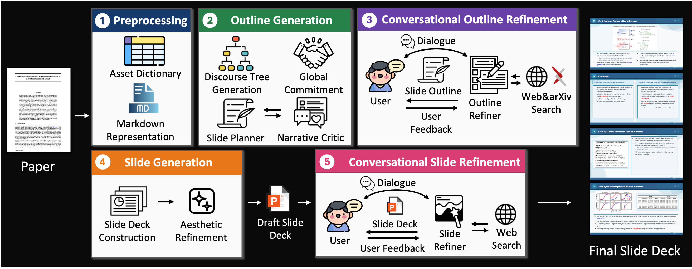
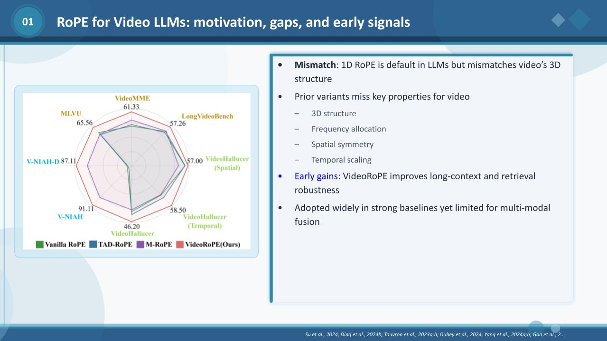
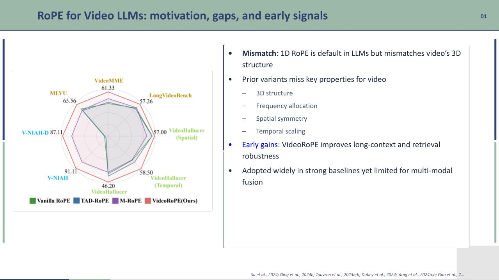
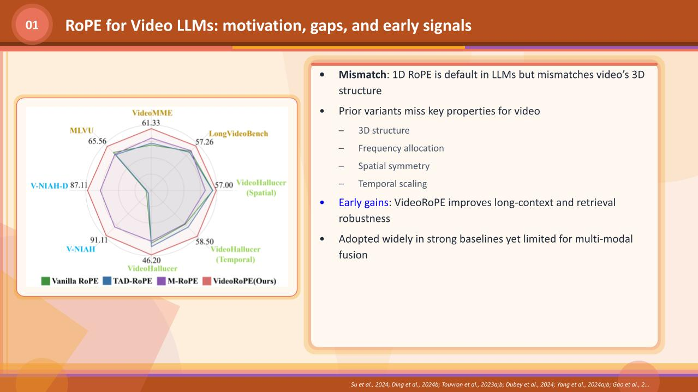
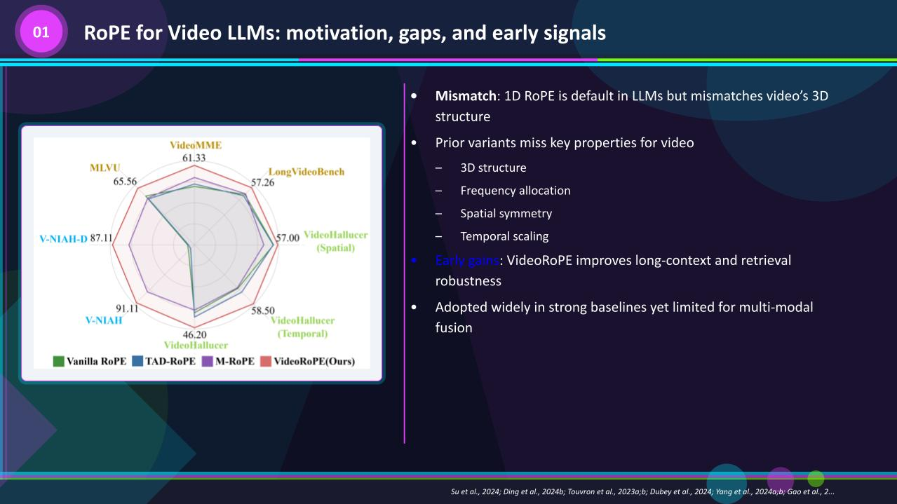
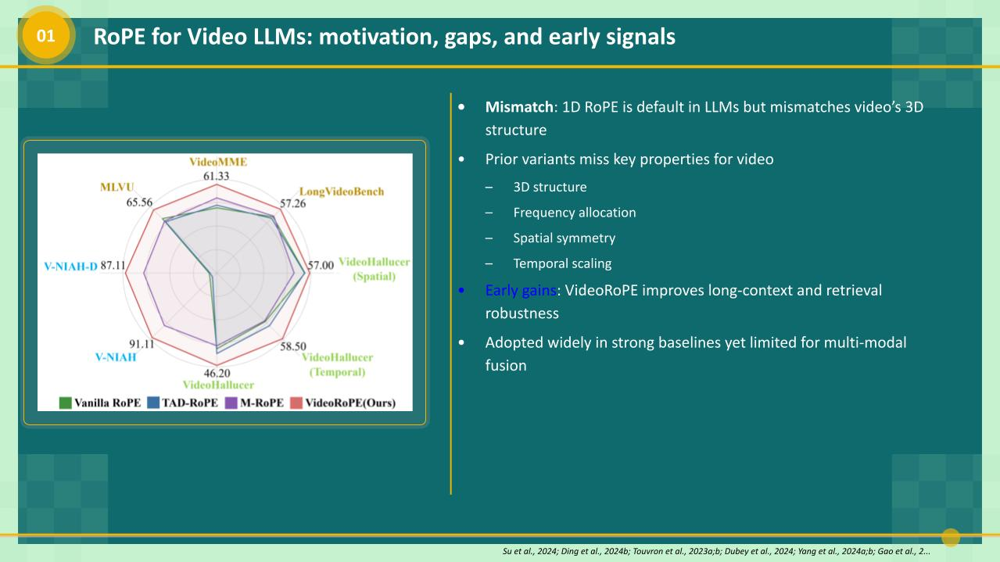
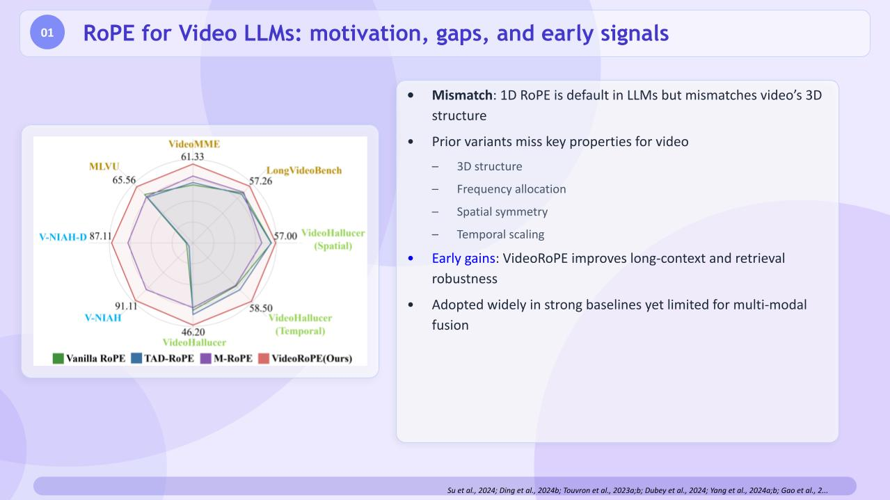

<p align="center">
  
</p>
<h3 align="center">Official Implementation of<br>ConvDeck: Conversational Paper-to-Slide Generation via Stage-Specific User Feedback</h3>

<p align="center">
  <b>Tarik Can Ozden</b><sup>*</sup> &nbsp;
  <b>Sachidanand VS</b><sup>*</sup> &nbsp;
  <b>Furkan Horoz</b><sup>*</sup> &nbsp;
  <b>Ozgur Kara</b> &nbsp;
  <b>Dilek Hakkani-Tür</b><sup>†</sup> &nbsp;
  <b>Junho Kim</b><sup>†</sup> &nbsp;
  <b>James M. Rehg</b><sup>†</sup>
</p>
<p align="center">
  University of Illinois Urbana-Champaign<br>
  <sup>*</sup> Equal contribution &nbsp;&nbsp; <sup>†</sup> Corresponding author
</p>

<p align="center">
  <b>EMNLP Findings 2026</b>
</p>

<p align="center">
  <a href="#quick-start">Quick Start</a> &bull;
  <a href="#pipeline-overview">Pipeline</a> &bull;
  <a href="#cli-usage">CLI Usage</a> &bull;
  <a href="#interactive-app">Interactive App</a> &bull;
  <a href="#outputs">Outputs</a> &bull;
  <a href="#slide-designs">Designs</a> &bull;
  <a href="#citation">Citation</a>
</p>

<p align="center">
  <a href="https://arxiv.org/abs/2609.00226">
    
  </a>
  <a href="https://convdeck.github.io/">
    
  </a>
  <a href="https://huggingface.co/spaces/ozdentarikcan/ConvDeck">
    
  </a>
  
</p>


---

<p align="center">
  <b>ConvDeck</b> is a multi-agent system for <b>conversational</b> paper-to-slide generation. It converts an academic PDF into a polished presentation deck (<code>.pptx</code>), and unlike single-pass or post-hoc-editing systems, distributes user interaction across the pipeline through <b>stage-specific refinement loops</b>: one over the <b>outline</b>, and one over the <b>rendered deck</b>. Outline and slide generation follow the narrative-driven, RST-based design of <a href="https://arcdeck.org"><b>ArcDeck</b></a> (Ozden et al., 2026; <a href="https://github.com/RehgLab/ArcDeck">code</a>); each conversational refiner uses a <b>speak–act</b> (ReSpAct-style) mechanism that can reason, ask clarifying questions, and apply localized edits. Slides are rendered to <code>.pptx</code> via <b>PptxGenJS</b> (Node).
</p>

---

## Pipeline Overview

<p align="center">
  
</p>

Given a paper PDF and two optional inputs — a **target audience** and a **presentation duration**, ConvDeck produces a final deck through **five sequential stages**. The pipeline runs end-to-end from `slide_generation/pipeline.py`, and nearly every stage caches its output under `contents/<paper_name>/`, so a re-run resumes where it left off (delete a cache file to force that stage to re-run).

> **On interaction:** Stages 3 and 5 are *conversational* — in the paper the feedback comes from the presenter. For reproducible batch runs this repository drives both loops with an **LLM/VLM-based user simulator** that stands in for the presenter; a real user can be swapped in to make them interactive.

<details>
<summary><b>Pipeline details</b> — the five stages, step by step</summary>

### Stage 1 — Preprocessing

Parses the paper into two artifacts that ground all later generation:
- A **markdown representation** of the paper text (via **Docling**; falls back to **Marker** if extraction is too short). The references section is separated into a **citation-key dictionary** so in-text citations are preserved, and content after the references is discarded. Saved as `*_initial_markdown.md`.
- An **asset dictionary** of the paper's **figures and tables** with their captions, cropped from the PDF.
- Optionally, the markdown is **summarized** into `*_processed.md` (on by default; `--summarize false` disables it and passes the full markdown through).

### Stage 2 — Outline Generation

Builds an initial draft outline from the markdown. Following [**ArcDeck**](https://arcdeck.org) (Ozden et al., 2026), it is narrative-driven with three components:
- **Discourse Parser** — builds an **RST-based discourse tree** capturing the rhetorical relations between paragraphs.
- **Commitment Builder** — consumes the target audience and presentation duration to produce a **global commitment** (`commitments.md`) that summarizes the deck's high-level intent. Also honors `--user_instructions`.
- **Narrative Refinement** — drafts and revises the outline through a **Slide Planner / Reviser** and **Narrative Critic** cycle.

Since user-driven outline refinement is deferred to Stage 3, this internal loop is run once. Output: `*_raw_content_rst.json` — per-slide `title`, `content`, and a `discussion_idea` (a short "what this slide is about" beat).

### Stage 3 — Conversational Outline Refinement

Updates the outline from user feedback **before any slides are rendered**, so high-level structure and narrative can be fixed cheaply. The user reviews a preview (slide titles + discussion ideas) alongside the summarized paper, and an **Outline Refiner** applies the requested changes as **localized edit operations** (add / edit / split / merge / remove / reorder) — untouched slides are preserved verbatim.

The refiner follows a **speak–act** mechanism inspired by **ReSpAct** (Dongre et al., 2025), operating in two modes:
- **Think + Speak** — reasons about the request and asks a clarifying question when information is missing.
- **Think + Act** — reasons and applies the edits.

To bring in material beyond the source paper when asked (e.g., related work or extra baselines), the refiner is equipped with an **arXiv retrieval tool**.

### Stage 4 — Slide Generation

Converts the refined outline into a **draft slide deck**. Following [**ArcDeck**](https://arcdeck.org), it uses two agents:
- **Slide Deck Constructor** — selects relevant figures/tables, chooses a slide **layout** that accommodates the visuals and text, and writes concise bullets and sub-bullets, producing a slide specification in structured JSON (`*_slide_plan.json`).
- **Aesthetic Refiner** — a final pass that adds visual content to figureless slides, expands sparse bullets, and applies **boldface / color emphasis** to key information.

The slide specification is translated into **JavaScript compiled to `.pptx` via PptxGenJS** (run with `node`). This JS is a structured, editable view of the slide elements and serves as the **editable state** for Stage 5. Visual style is set by `--js_theme` (color palette) and `--js_design` (decoration layout).

### Stage 5 — Conversational Slide Refinement

Applies a **second round of feedback on the rendered deck**. Unlike the Aesthetic Refiner in Stage 4 (which only sees the specification), this stage observes the **actual rendered slides** and can correct rendering issues — text overflow, undersized figures, crowded layouts. The user reviews rendered slide images and a **Slide Refiner** applies **localized** edits to the affected slides using the same speak–act mechanism, supporting insertion, deletion, modification, splitting, merging, reordering, repositioning, resizing, and typography changes. Each edit is applied to the JS editable state, after which `node` re-renders the `.pptx` (rolling back automatically if the render fails).

In this repository the Stage-5 reviewer is a **VLM** over the rendered slide images and currently requires a **GPT-5** backend; all earlier stages run on any supported model.

</details>

---

News
- [08/2026]: 🤗 You can try out ConvDeck demo from [HuggingFace Spaces](https://huggingface.co/spaces/ozdentarikcan/ConvDeck)!
- [08/2026]: 🚀 We have open-sourced the ConvDeck codebase on [GitHub](https://github.com/RehgLab/ConvDeck)!
- [08/2026]: ConvDeck is available on [arXiv](https://arxiv.org/abs/2609.00226).
- [08/2026]: 🚀 ConvDeck has been accepted to EMNLP Findings 2026!
- [06/2026]: 🚀 ArcDeck has been accepted to ECCV 2026!
- [04/2026]: 🚀 We have open-sourced the ArcDeck codebase on [GitHub](https://github.com/RehgLab/ArcDeck)!
- [04/2026]: ✨ The ArcBench benchmark has been released on [HuggingFace](https://huggingface.co/datasets/ArcDeck/ArcBench)!
- [04/2026]: 📜 Narrative-Driven Paper-to-Slide Generation via ArcDeck is now available on [arXiv](https://arxiv.org/abs/2604.11969)!

---

## Quick Start

### Install

```bash
pip install -r requirements.txt

# Rendering (required):
#   Node.js + PptxGenJS  — builds the .pptx
#   LibreOffice + Poppler — used to render slides to images for deck feedback
npm install pptxgenjs        # one-time, in the repo root
# conda install -c conda-forge poppler
```

### Set API Keys

Create a `.env` file in the project root:

```bash
OPENAI_API_KEY=sk-...
# Or set other provider keys as needed

# Optional — enables the reviser's arXiv/literature retrieval tool (Paperclip)
# during the conversational refinement stages. You can get a key from https://paperclip.gxl.ai.
# A missing key won't crash a run; the tool just returns an error to the agent.
PAPERCLIP_MCP_API_KEY=...
```

---

## CLI Usage

**Basic** — runs the full pipeline; all refinement stages are **on by default**:

```bash
python -m slide_generation.pipeline path/to/paper.pdf --model gpt-5
```

**Disable a refinement stage** — each conversational stage can be turned off with its `--no_*` flag (e.g. skip the Stage 5 slide-feedback loop):

```bash
python -m slide_generation.pipeline path/to/paper.pdf --model gpt-5 --no_js_feedback
```

**Full options:**

```bash
python -m slide_generation.pipeline path/to/paper.pdf \
    --model gpt-5 \
    --duration 20 \
    --audience researchers \
    --js_theme 0 \
    --js_design 5 \
    --user_instructions "Emphasize the method; keep math light."
```

**Skip summarization (feed the full paper to every agent):**

```bash
python -m slide_generation.pipeline path/to/paper.pdf --model gpt-5 --summarize false
```

### CLI Flags

| Flag | Description | Default |
|------|-------------|---------|
| `paper_path` | Path to the input PDF | *(required)* |
| `--model` | LLM model name (see [Supported Models](#supported-models)) | `gpt-5` |
| `--summarize` | Summarize the paper into `processed.md` before outline generation. `--summarize false` feeds the full markdown to every agent. | `true` |
| `--duration` | Target talk length in minutes | `20` |
| `--audience` | Target audience | `researchers` |
| `--no_outline_feedback` | Disable simulated feedback on the outline during Stage 2 | *(on)* |
| `--no_llm_feedback` | Disable the Stage 3 LLM/VLM-simulated content-feedback loop | *(on)* |
| `--no_use_respact` | Disable the ReSpAct reviser in the Stage 3 loop | *(on)* |
| `--no_use_edit_ops` | Reviser regenerates the whole slide list instead of localized edit operations | *(on)* |
| `--no_js_feedback` | Disable the Stage 5 simulated feedback loop on the rendered deck | *(on)* |
| `--interactive` | Run Stages 3 & 5 as an interactive **human** session (blocks on `input()` for real-user feedback) instead of the LLM/VLM simulator. Drives the study web app. | off |
| `--user_instructions` | Free-form global instructions, baked into `commitments.md` and used throughout | *(none)* |
| `--js_theme` | PptxGenJS color theme (`0`, `4`, `6`, `7`) | `0` |
| `--js_design` | PptxGenJS decoration layout (0–5) | `5` |
| `--no_log_interactions` | Disable logging of agent interactions + user feedback to `*_interaction_log.jsonl` | *(on)* |
| `--paper_name` | Override the output-folder name (defaults to the PDF filename) | *(derived)* |

> The conversational refinement stages (3 and 5) and localized edit-ops are **on by default**; turn any of them off with the corresponding `--no_*` flag above.

> `--template` is still accepted for backward compatibility but is a **no-op** — it belonged to a retired python-pptx renderer. Use `--js_theme` / `--js_design` instead.

---

## Interactive App

For an **interactive app** — where you make conversation with the system as a person, not the LLM/VLM simulator, gives the Stage 3 & 5 feedback — two web front-ends are included. Both spawn `slide_generation.pipeline … --interactive` as a subprocess, show the outline and live-rendered slides, and let a participant give free-form feedback and approve at each stage.

```bash
# Gradio front-end (requires `pip install gradio`)
python gradio_app.py     # → http://localhost:7860

# ...or the FastAPI + single-page UI
python app.py            # → http://localhost:7860
```

Host/port are set via `CONVDECK_HOST` / `CONVDECK_PORT` (default `0.0.0.0:7860`). Each session gets a unique `paper_name`, so concurrent participants never collide under `contents/` or `tmp/`. The flow is **outline review → deck review → done**; all free-form feedback is captured in the interaction log. Drop `study_papers/*.pdf` (or use `dataset/`) to populate the paper picker.

---

## Outputs

Generated files are saved under `contents/<paper_name>/`, prefixed with `<model_model>`:

| File | Description |
|------|-------------|
| `*_initial_markdown.md` | Extracted paper markdown (pre-processing) |
| `*_processed.md` | Summarized (or full) markdown consumed by every downstream agent |
| `*_commitment.md` | Global commitment contract |
| `*_raw_content_rst.json` | Narrative outline (`title` / `content` / `discussion_idea` per slide) |
| `*_raw_content.json` | Nested outline consumed by the figure/layout agents |
| `*_figures.json` | Figure/table → slide mapping |
| `*_slide_plan.json` | Final slide plan (templates, bullets, placements) |
| `*_pptxgenjs_theme{T}_design{D}.js` | Generated Node/PptxGenJS render script |
| `*_output_slides_pptxgenjs_theme{T}_design{D}.pptx` | **Final PowerPoint** |
| `*_log.json` | Per-stage token usage & timing |

RST intermediates (per-section discourse trees, `paragraphs.json`) are written under `rst_outputs/<paper_name>/`, and cropped figure/table images under `<model_model>_images_and_tables/<paper_name>/`.

---

## Slide Designs

`--js_design` selects the geometric/ambient decoration style (background shapes, footer, title-bar framing).

<table>
  <tr>
    <th width="33.33%">Design 0 — Circles &amp; Bokeh</th>
    <th width="33.33%">Design 1 — Geometric Angular</th>
    <th width="33.33%">Design 2 — Sunset Gradient</th>
  </tr>
  <tr>
    <td></td>
    <td></td>
    <td></td>
  </tr>
  <tr>
    <th>Design 3 — Aurora Neon</th>
    <th>Design 4 — Teal Minimalist</th>
    <th>Design 5 — Glassmorphism</th>
  </tr>
  <tr>
    <td></td>
    <td></td>
    <td></td>
  </tr>
</table>

`--js_theme` (`0`, `4`, `6`, `7`) selects the color palette applied on top of the chosen design.

---

## Supported Models

Configured via `utils/llm/config.py`. Supported platforms:

- **OpenAI** — GPT-4o, GPT-5 (GPT-5 uses the Responses API)
- **vLLM** — local models (e.g., Qwen 2.5 / Qwen3-VL)
- **DeepInfra / OpenRouter / Qwen** — OpenAI-compatible endpoints

> The **Conversational Slide Refinement** stage (Stage 5) currently requires a **GPT-5** backend; on other models it is skipped. All earlier stages run on any supported model.

---

## Repository Structure

```
ConvDeck/
├── slide_generation/
│   ├── pipeline.py                 # Entry point — orchestrates all stages
│   ├── outline_generation/         # Summarization, commitment, RST parse,
│   │                               #   planner, critic, reviser, ReSpAct outline feedback
│   ├── content_generation/         # Figure extraction/matching, layout planner,
│   │                               #   refiner, LLM/VLM feedback simulators, JS deck feedback
│   ├── renderer/                   # PptxGenJS (Node) code generation
│   ├── tools/                      # arXiv / paperclip retrieval tools
│   ├── edit_ops.py                 # Localized outline edit operations
│   └── edit_ops_js.py              # Localized JS/deck edit operations
├── prompts/
│   ├── outline/                    # Summarizer, commitment, section RST, planner, critic, reviser
│   └── pipeline/                   # Figure filter/match, caption fixer, layout agent,
│                                   #   refiner, feedback simulators, JS revision
├── utils/                          # LLM config/chat, pptx helpers, styling
├── assets/                         # Preview images
└── requirements.txt
```

---

## Citation

If you find ConvDeck useful in your research, please cite our paper:

```bibtex
@article{ozden2026convdeck,
  title     = {ConvDeck: Conversational Paper-to-Slide Generation via Stage-Specific User Feedback},
  author    = {Ozden, Tarik Can and VS, Sachidanand and Horoz, Furkan and
               Kara, Ozgur and Hakkani-T{\"u}r, Dilek and Kim, Junho and Rehg, James M.},
  journal   = {arXiv preprint arXiv:2609.00226},
  year      = {2026}
}
```

## Contact, Support & Maintenance

For feedback, improvements, code support, or general inquiries, please contact tozden2@illinois.edu.
